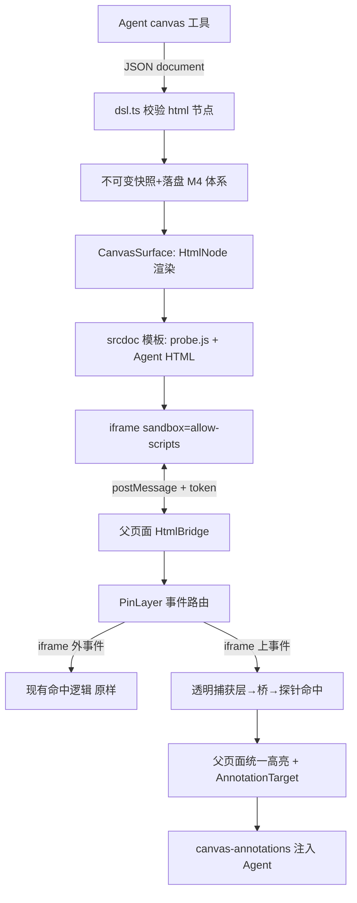

## 产品概述

为 qoder-canvas 增加 `html` 节点与「增强档标注底座」：Agent（借助 baoyu-design / huashu-design / kami / archify / lieflat-charts 等社区 skill 或裸 HTML 能力）生成的任意 HTML 可作为画布节点渲染，且 iframe 内部元素完整支持元素级「点选、框选、划字」三模式标注回流。这是一次性底座投资——做完后任何 skill / 裸 HTML 产物自动获得标注能力，未来新 skill 零适配。

## 核心功能

- **html DSL 节点**：`{ type: 'html', props: { source: '完整HTML', title?: '...' } }`，严格校验（长度上限、fail-closed），进入不可变快照/目录/版本管理体系
- **iframe 沙箱渲染**：复用 html-artifact 已验证模式（`sandbox="allow-scripts"` + srcdoc 模板 + referrerPolicy），安全边界与 artifact 同级
- **探针（一次性基建）**：固定 JS 打包进插件，渲染 html 节点时自动拼入 srcdoc 顶部（Agent/skill 零配合），在 iframe 内部执行与外层同款的命中逻辑（elementsFromPoint / 矩形相交 / Selection API）
- **消息桥**：token 校验的 postMessage 协议（父 ↔ iframe：hit 请求/响应、模式切换、划字事件、滚动/尺寸同步）
- **双层事件路由**：事件落在 iframe 外→现有 PinLayer 处理；落在 iframe 上→透明捕获层拦截→经桥问探针→命中则选中、未命中穿透
- **父页面统一高亮**：探针回传 iframe 内元素 rect，父页面换算坐标（iframe 容器偏移 + 内部滚动）后画高亮框/tooltip，多 iframe 不错位
- **标注回流扩展**：html 节点内元素的 target 携带 `iframe 内 domPath + 元素信息 + HTML 源码定位线索`，注入格式让 Agent 知道改 source 的哪部分
- **降级保底**：探针未就绪/超时（版本迭代重渲染瞬间）→ html 节点整体可选中/框选/评注（节点级标注不中断）
- **工具描述更新**：告知 Agent html 节点用法与混排建议（结构化内容用 DSL 节点、富排版/演示用 html 节点）

## Tech Stack

- 现有栈延续：TypeScript + React（client 半）+ cordis（host 半）+ vitest；不引入新依赖
- iframe 沙箱：**修正决策**——采用 html-artifact 先例（`dsh-vp-boundary/packages/artifact/src/client/ArtifactCard.tsx:76` 实证）：`sandbox="allow-scripts"`（**不加** allow-same-origin，opaque origin 隔离宿主）+ 每帧随机 token 的 postMessage 协议。比讨论时定的同源方案更安全且探针架构完全兼容；srcdoc 模板注入探针的位置参考其 `buildArtifactDocument` 模式

## 实现方案

### 架构（渲染管道与事件流）



### 模块划分（全部在 packages/qoder-canvas 内）

1. **dsl.ts**：NODE_REGISTRY 注册 `html` 节点；NodePropRule 新增 `html-source` kind（string，上限 ~100KB，fail-closed 校验）；更新节点集注释（10→11 节点）
2. **client/probe.ts（新建）**：自包含探针脚本。实现要点：

- 以**字符串常量**形式打包（不 import 外部符号，严格 IIFE），构建时经 tsdown 进 client bundle，运行时作为模板拼入 srcdoc 顶部
- 复用 CanvasPinLayer 已验证逻辑（本会话沉淀）：elementsFromPoint 最深层命中、domPathWithin 带 `:nth-of-type`、矩形相交+占比、TreeWalker 划字索引——但面向 iframe 自身 document 重写为无依赖版本
- 监听父页面指令（mode 切换、hit 查询、marquee rect 查询），只回数据不画 UI（视觉统一在父页面）

3. **client/html-bridge.ts（新建）**：父页面侧协议端。职责：生成/校验 per-frame token、管理 iframe 注册表（nodeId ↔ frame ↔ token）、坐标换算（iframe 容器 getBoundingClientRect 偏移 + contentWindow scroll 补偿）、探针就绪探测与降级判定（如 800ms 未 ready → 标记该节点走节点级降级）
4. **client/HtmlNode.tsx（CanvasSurface 内或独立文件）**：html 节点渲染器——nodeBase 外框 + 标题条 + iframe（sandbox/srcdoc/自适应高度：探针上报 content 高度，父页面设容器高度，上限+内部滚动）+ 探针注入的 srcdoc 模板函数
5. **CanvasPinLayer.tsx 扩展**：

- `hitElement`/`hitMarquee` 扩展：命中目标在 html 节点 iframe 区域内时，经 bridge 同步查询探针（`await` 化或预取缓存——pointermove 时用 requestAnimationFrame 节流预取，点击时零延迟）
- iframe 上方**透明捕获层**（仅选择模式激活时挂载，pointerEvents:auto；点选命中探针元素→选中，未命中→放行穿透给 iframe 正常交互；框选/划字模式全拦）
- 高亮渲染扩展：`HighlightEl` 支持跨 iframe 命中（rect 来自探针回传，父页面换算后画）
- **沿用 inFloatPanel 豁免教训**：捕获层自身事件不重复触发外层命中

6. **canvas-annotations.ts 扩展**：AnnotationTarget 新增变体 `{ kind: 'html-element', id: html节点id, domPath, tag, text, snippet }`（snippet = 命中元素的 outerHTML 截断 ~600 字符）；formatAnnotationBatch 输出 `<target type="html" id="nX" path="nodes[i]" element="..." tag="..." text="...">{snippet + 定位说明}</target>`，并诚实附注「HTML 无结构化 path，请按源码片段文本匹配定位修改」
7. **index.ts**：工具 description + parameters schema 文本更新（html 节点用法、混排建议、量级上限）；`document` 参数描述同步 11 节点

### 关键协议（类型定义）

```ts
/** html-bridge 消息协议（父↔iframe，双向均带 token 校验） */
type ProbeMessage =
  | { t: 'ready'; token: string }                                    // 探针就绪+内容高度
  | { t: 'height'; token: string; height: number }                   // 内容高度变化（自适应）
  | { t: 'hit'; token: string; x: number; y: number;                 // 父→iframe 点查询（iframe 视口坐标）
      result: HtmlHit | null }                                        // iframe→父 响应（含 rect/tag/domPath/text/snippet）
  | { t: 'marquee'; token: string; rect: IframeRect;                 // 父→iframe 框选查询
      result: HtmlHit[] }
  | { t: 'selection'; token: string; excerpt: string; domPath: string } // iframe→父 划字上报
  | { t: 'mode'; token: string; mode: 'point' | 'marquee' | 'text' | 'off' }

interface HtmlHit {
  domPath: string        // 带 :nth-of-type 的 iframe 内路径
  tag: string
  text?: string          // ≤40 字符
  snippet: string        // outerHTML ≤600 字符（注入 Agent 定位用）
  rect: { x: number; y: number; w: number; h: number }  // iframe 视口坐标系
}
```

### 性能与可靠性

- pointermove 探针查询用 **rAF 节流 + 最近一次缓存**（避免每 move 一次 postMessage 往返）；点击命中读缓存，框选只在 pointerup 查询一次
- iframe 自适应高度：探针 ResizeObserver 上报，父页面 clamp（min 200 / max 640，超出内部滚动）
- 探针重初始化（版本迭代换 srcdoc）：bridge 检测 ready 超时（800ms）→ 该节点临时节点级降级，ready 后恢复元素级——保底档逻辑内嵌于增强档
- 严格模式/exactOptionalPropertyTypes 全程遵守（本会话已多次踩）

### 目录结构（修改/新增）

```
packages/qoder-canvas/
├── src/
│   ├── dsl.ts                        # [MODIFY] html 节点注册 + html-source PropRule + 注释
│   ├── index.ts                      # [MODIFY] 工具描述/schema 文本（11 节点 + html 用法）
│   └── client/
│       ├── probe.ts                  # [NEW] iframe 内探针（自包含字符串，~250 行）
│       ├── html-bridge.ts            # [NEW] 父页面协议端 + token + 坐标换算 + 降级判定
│       ├── CanvasSurface.tsx         # [MODIFY] HtmlNode 渲染分发 + srcdoc 模板
│       ├── CanvasPinLayer.tsx        # [MODIFY] 事件路由扩展 + 透明捕获层 + 跨 iframe 高亮
│       └── canvas-annotations.ts     # [MODIFY] html-element target + 注入格式扩展
└── tests/
    ├── dsl.spec.ts                   # [MODIFY] html 节点校验用例（通过/超限/缺 source）
    └── annotation-format.spec.ts     # [MODIFY] html-element 注入格式用例
```

## 实现注意事项（本会话踩坑沉淀，必须遵守）

- Lexical composer 魔法字符：注入文本避开 `[`、行首 `1)`、`@`；编号 `#1`、分隔 `·`——snippet 内容可能含这些字符，注入时对 snippet 做首字符防御（起头补空格或换行包裹）
- 容器级原生事件监听器必须对内部浮层豁免（inFloatPanel 模式）——透明捕获层同款豁免，防穿透篡改 targets 状态机
- domPath 必带 `:nth-of-type`（回查唯一命中）——探针内的 domPathWithin 同规则
- 发布纪律：pnpm check → bump 0.9.0 → pack-all → **停 3085 实例后** dsh plugin add（运行中装包 pnpm 锁竞争失败）→ grep 包内容确认版本 → 真机验证 → git commit -F
- 真机验证必须「新建会话」；断言用 `[data-chat-flow-kind="user"]` 最后一条
- iframe 坐标换算是调试大头：探针 rect 是 iframe 视口坐标（含内部滚动偏移），父页面需加 iframe 容器偏移再减画布容器滚动——单测先覆盖换算纯函数，再真机对齐

## 验证方案（真机，3085 探测实例）

1. DSL：html 节点校验（合法/超限/缺 source 三态）
2. 渲染：Agent 生成含 html 节点画布 → iframe 呈现 + 自适应高度
3. 探针就绪：`ready` 消息 + 降级路径（人为延迟验证节点级兜底）
4. 三模式：iframe 内点选（DevTools 式 tooltip 带元素信息）、框选（rect 相交多元素）、划字（excerpt + domPath）
5. 回流：评注保存 → 胶囊 → 发送 → 消息含 `<target type="html" ...>{snippet}</target>`，Agent 能按 snippet 定位修改并重发新版本
6. M4 兼容：目录/版本切换/默认引用对含 html 节点画布照常；快照落盘含 source 完整

## Agent Extensions

### MCP

- **codegraph**
- Purpose: 执行阶段用 codegraph_explore 快速核对 CanvasSurface 节点分发、CanvasPinLayer 事件处理器的调用链与符号引用，确认修改点无遗漏调用方
- Expected outcome: 一次调用获得待改符号的完整源码与调用路径，减少多轮 grep/read

### SubAgent

- **code-explorer**
- Purpose: 实现完成后（提测前）用其复核跨文件影响面：probe.ts 字符串打包是否被 tsdown 正确内联、html-bridge 的 message 监听器是否有泄漏注册
- Expected outcome: 产出影响面清单，确认无未清理监听器/无打包逃逸